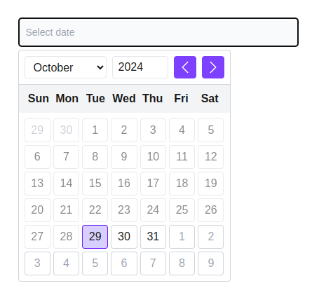

# hikma-datepicker - A Simple and Flexible React Datepicker Component


## Description
**hikma-datepicker** is a lightweight and flexible date picker reusable component, designed for easy integration into web applications. Customize date formats, styles, and locales effortlessly.




## Features
- Simple and lightweight date picker.
- Fully customizable date formats and themes.
- Compatible with Reactjs JavaScript & Typescript.

## Installation

Install the package via NPM:

```bash
npm install hikma-datepicker
```

Install the package via YARN:

```bash
yarn hikma-datepicker
```
Example :
```
import { UiDatepicker } from "hikma-datepicker";
import 'hikma-datepicker/dist/index.css';

const Example = () => {
  return (
   <UiDatepicker 
        disablePastDates={true} 
        dateFormat='dd-MM-yyyy' 
        onChange={(e) => alert(JSON.stringify(e))} 
   />
  );
};
```

Example with Tailwindcss :
```
import { UiDatepicker } from "hikma-datepicker";

const Example = () => {
  return (
   <UiDatepicker 
        disablePastDates={true} 
        dateFormat='dd-MM-yyyy' 
        onChange={(e) => alert(JSON.stringify(e))} 
   />
  );
};
```
Configuration with Tailwindcss for change your won color :
```
module.exports = {
  content: ["./src/**/*.{js,jsx,ts,tsx}"],  // Watch only the src folder
  theme: {
    extend: {
      colors: {
        primary: {
          50: "#f4f1ff",
          100: "#ebe5ff",
          200: "#d7cfff",
          300: "#bba8ff",
          400: "#9b77ff",
          500: "#7d40ff",
          600: "#6f19ff",
          700: "#6207fa",
          800: "#5206d1",
          900: "#4507ac",
          950: "#270075",
        },
      },
    },
  },
  plugins: [],
}
```

